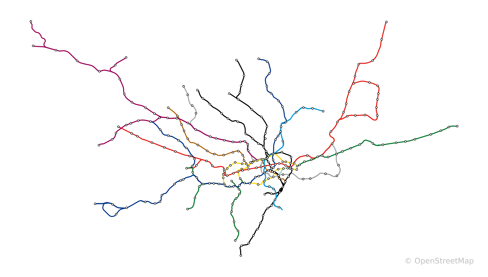

# London Underground Mapping Project

This project aims to map the London Underground using OpenStreetMap (OSM) data and visualize it using GeoPandas in Python.

## Overview

The London Underground, also known as the Tube, is a public rapid transit system serving London and some parts of the adjacent counties. This project extracts and visualizes the Tube network using OSM data.

## Features

- Extracts London Underground data from OSM files.
- Visualizes the Tube network using GeoPandas and Matplotlib.
- Adds station markers and annotates them with station names.

## Data Sources

- **OpenStreetMap (OSM)**: The project utilizes OSM data to extract the London Underground information.

## Getting Started

1. **Installation**:
   - Clone this repository.
   - Install required libraries using `pip install -r requirements.txt`.

2. **Usage**:
   - Run the Python script `scripts/osm_transform.py` to visualize the Tube network.

## Example Visualization

## Dependencies

- Python 3.x
- GeoPandas
- Matplotlib
- Osmium

This project is licensed under the [MIT License](LICENSE).